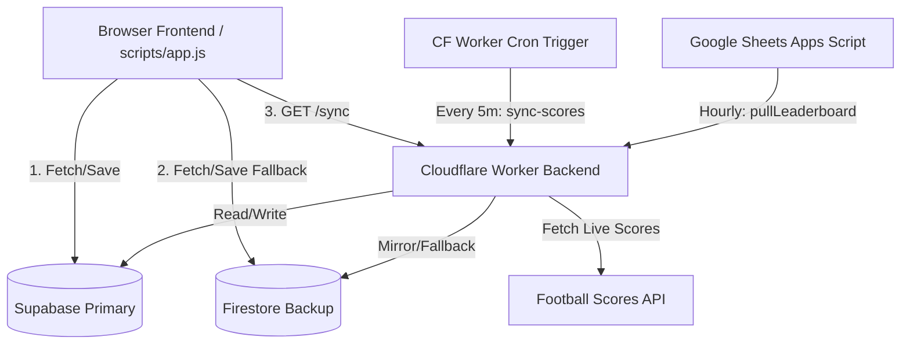

# GGO WC 2026 Predictor — Architecture
> Last updated: 2026-06-17

---

## System Overview

### 1. Core Components

*   **Browser Frontend (`index.html` + `scripts/app.js`)**: Direct browser client. Fetches and saves prediction entries directly via Supabase (primary) and Firestore (mirror/fallback). Connects to the Cloudflare Worker to fetch compiled tournament payloads (`/sync`) and leaderboard data.
*   **Cloudflare Worker Backend (`workers/live-results.js`)**: Primary API backend.
    *   Exposes endpoints `/sync`, `/sync-scores`, `/fixtures`, and `/leaderboard`.
    *   Executes every 5 minutes via Cloudflare Cron Triggers to fetch live scores, updates tables, and recalculates standings.
    *   Implements the leaderboard ranking engine.
*   **Google Apps Script (`src/main.js`)**: Run-time client backup. Runs once an hour via a simple time-driven trigger to fetch the current leaderboard from the Cloudflare Worker (`GET /sync`) and populate the Google Sheet cells visually.

---

## Data Load Priority (Browser)

Each data type has a resilient fallback hierarchy:

| Data | Tier 1 (Primary) | Tier 2 (Backup) | Tier 3 (Fallback) |
| :--- | :--- | :--- | :--- |
| **All game data** | `/sync` (Cloudflare Worker) | Direct Supabase fetch | Firestore / Local JSON |
| **Fixtures** | `/fixtures` (Cloudflare Worker) | Supabase `fixtures` | `2026/worldcup.json` |
| **Results** | `/sync` (Cloudflare Worker) | Supabase `results` | Firestore `results` |
| **Predictions** | Supabase `predictions` | Firestore `predictions` | localStorage |
| **Leaderboard** | `/leaderboard` (Cloudflare Worker) | Supabase `leaderboard` | buildLocalLeaderboard() |

---

## Database Schemas (Canonical)

### `fixtures`
*   `matchId`: string (primary key, sequential e.g. `"1"`, `"72"`)
*   `round`: string
*   `group`: string
*   `stage`: string ("group" or "knockout")
*   `date`: string ("YYYY-MM-DD")
*   `time`: string
*   `kickoffUTC`: timestamptz
*   `team1`: string
*   `team2`: string
*   `ground`: string
*   `apiFixtureId`: int (nullable) — maps `worldcup26.ir` `game.id` to this row; required for reliable score sync

**Score sync mapping:** live API `game.id` → `fixtures.apiFixtureId` → `fixtures.matchId` → `results.matchId`. Predictions always use `fixtures.matchId`. See `scripts/repair-matchids.js` if rows drift.

### `predictions`
*   `id`: string (primary key, formatted as `${username}_${matchId}`)
*   `username`: string
*   `matchId`: string
*   `pred1`: int
*   `pred2`: int
*   `submittedAt`: timestamptz
*   `pointsAwarded`: int (nullable)
*   `scoredAt`: timestamptz (nullable)

### `results`
*   `matchId`: string (primary key)
*   `score1`: int
*   `score2`: int
*   `status`: string ("FT", "HT", "LIVE", "NS")
*   `lastUpdated`: timestamptz

### `users`
*   `username`: string (primary key)
*   `displayName`: string
*   `secretCode`: string
*   `isAdmin`: boolean
*   `totalPoints`: int
*   `joinedAt`: timestamptz

### `leaderboard`
*   `username`: string (primary key)
*   `rank`: int
*   `displayName`: string
*   `totalPoints`: int
*   `exactScores`: int
*   `correctOutcomes`: int
*   `predicted`: int
*   `scored`: int
*   `updatedAt`: timestamptz

### `accountRequests`
*   `username`: string (primary key)
*   `displayName`: string
*   `note`: string
*   `status`: string ("pending", "approved", "rejected")
*   `secretCode`: string
*   `createdAt`: timestamptz
*   `approvedAt`: timestamptz (nullable)
*   `rejectedAt`: timestamptz (nullable)

---

## Deployments

*   **Frontend**: Hosted statically (Firebase Hosting, GitHub Pages, or any static server).
*   **Worker API**: Deployed to Cloudflare using `npx wrangler deploy`.
*   **Sheets Sync**: Pushed to Google Apps Script using `clasp push` on target project ID `1Lx-q30o3CFcM7_h6OiuoiPNgRzaZE2SK_WnKkPFoBplS8W4ckWWa0B_0`.
