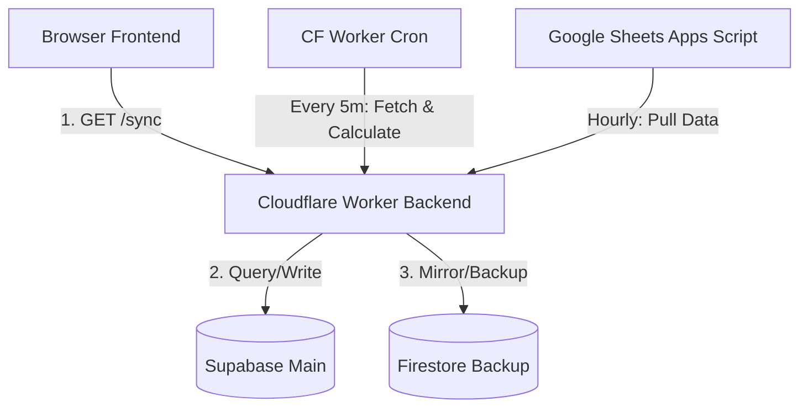

# Migration Plan: Moving Backend to Cloudflare Workers & Setting Up Sheet Pull Backup

We are moving the main backend processing entirely to **Cloudflare Workers** (with **Supabase** as primary and **Firestore** as backup) to resolve Google Apps Script `UrlFetchApp` rate limits. The Google Sheet will serve as a **third backup** by pulling data periodically from the Worker.

---

## 1. Database & Backend Architecture



### **1.1 Database Roles**
- **Supabase**: Main datastore. Stores `fixtures`, `results`, `predictions`, `users`, `leaderboard`, and `accountRequests`.
- **Firestore**: Secondary backup. Mirrors all writes and acts as a fallback for reads.
- **Google Sheets**: Third backup. Visually displays predictions and the leaderboard.

### **1.2 Backend API Roles**
- **Cloudflare Worker**: Main API backend.
  - Handles `/sync` requests from frontend.
  - Fetches live scores via Cron (every 5 minutes).
  - Recalculates the leaderboard automatically on every score sync.
  - Exposes CORS headers so frontend can connect directly.
- **Google Apps Script**: Simple scheduled pull script. Runs hourly to pull `/sync` data from the Worker and update Sheet tabs.

---

## 2. Implementation Steps

### **Step 2.1: Add "accountRequests" to Supabase**
We will add the `accountRequests` table to the Supabase setup guidelines:
```sql
create table if not exists "accountRequests" (
  username text primary key,
  "displayName" text,
  note text,
  status text default 'pending',
  "secretCode" text,
  "createdAt" timestamptz default now(),
  "approvedAt" timestamptz,
  "rejectedAt" timestamptz
);
```

### **Step 2.2: Cloudflare Worker Implementation ([workers/live-results.js](file:///C:/Users/abdel/onedrive/desktop/ggofiles/ggowcpredictor/workers/live-results.js))**
1. **Supabase Client REST Helper**: Add light-weight `fetch` wrappers for Supabase REST API queries and upserts.
2. **Generic Collection Loader**: Query Supabase first, fallback to Firestore REST.
3. **Leaderboard Calculation Engine**: Add Javascript scoring engine (`scoreMatch`) to calculate points and rankings on the fly.
4. **Endpoint Router**:
   - `GET /sync`: Returns JSON payload of fixtures, results, users, and leaderboard.
   - `GET /sync-scores`: Triggers live score fetch (from `worldcup26.ir` / Zafronix), updates databases, recalculates leaderboard, and returns data.
   - `GET /fixtures` & `GET /leaderboard`: Sub-endpoints for specific resources.
5. **CORS support**: Enable Access-Control-Allow-Origin headers on all endpoints.

### **Step 2.3: Frontend Browser App Implementation ([scripts/app.js](file:///C:/Users/abdel/onedrive/desktop/ggofiles/ggowcpredictor/scripts/app.js))**
1. Update `scripts/app.js` to define Supabase configuration.
2. Refactor predictions, authentication, and login checks to check Supabase first, then fallback to Firestore.
3. Update settings to point to the Cloudflare Worker URL instead of Apps Script.

### **Step 2.4: Google Apps Script Implementation ([src/main.js](file:///C:/Users/abdel/onedrive/desktop/ggofiles/ggowcpredictor/src/main.js))**
1. Add `pullLeaderboardFromWorker()` to Apps Script.
2. Set up a simple time-driven trigger in Sheets to run `pullLeaderboardFromWorker` every hour.
3. Keep Apps Script GET/POST endpoints as optional legacy fallback.

### **Step 2.5: Recover June 14th Calculations**
1. Sync results for matches 9, 10, 11, and 12 from the live games API to Supabase and Firestore.
2. Run the leaderboard recalculation to update rankings.
3. Run the Sheets pull script once to update the visual spreadsheet.

---

## 📈 Migration Status
- **Step 2.1 (Supabase `accountRequests` table)**: Completed.
- **Step 2.2 (Cloudflare Worker backend)**: Completed & Optimized (including OAuth token caching & try-catch key imports).
- **Step 2.3 (Frontend App integration)**: Completed (Supabase prioritized client, settings updated for Cloudflare Worker URL).
- **Step 2.4 (Apps Script pull script)**: Completed (pullLeaderboardFromWorker hourly trigger added to main.js).
- **Step 2.5 (Recover June 14th Calculations)**: Completed (Data gap closed, predictions & results synced Firestore -> Supabase, score-flip bug resolved, and leaderboard successfully verified).
- **Step 2.6 (Enabling RLS & Merging Logic)**: Completed. Enable RLS on all Supabase tables, and introduce a resilient dual-database merging loader (Supabase + Firestore) in the frontend, backend worker, and Apps Script. This resolves cross-device prediction desync and leaderboard recalculation discrepancies.

**Migration Status: 100% Complete & Production Ready.**

